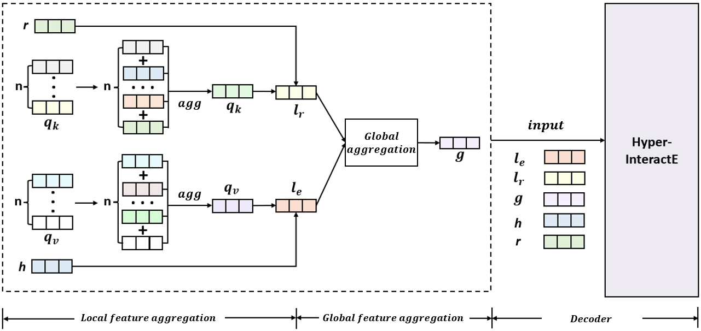
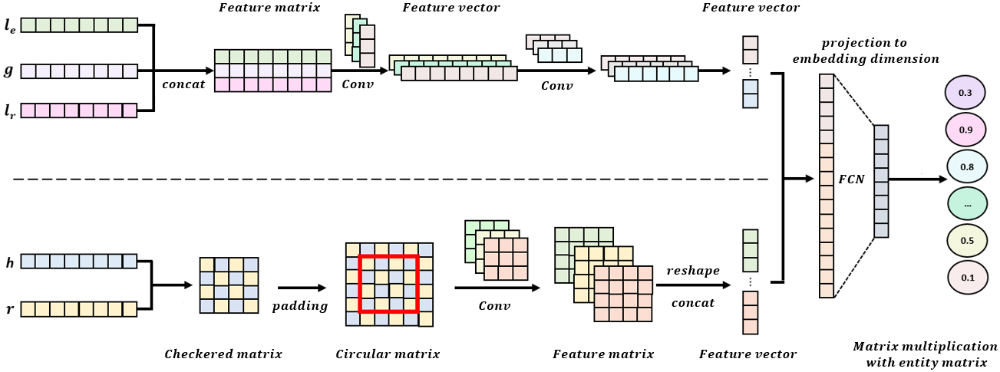

<h1 align="center">
  LGHAE
</h1>
<h4 align="center">LGHAE: Local and Global Hyper-relation Aggregation Embedding for Link Prediction</h4>
<h2 align="center">
  Overview of LGHAE
  
</h2>
<h2 align="center">
  Overview of Hyper-InteractE
  
</h2>

### Dependencies

- PyTorch 1.x and Python 3.x.
  
### Acknowledgement

- Parts of our codes come from [StarE](https://github.com/migalkin/StarE), [InteractE](https://github.com/malllabiisc/InteractE), and [HIAE](https://github.com/yuanpeikai/HIAE). Thanks for their contributions.

